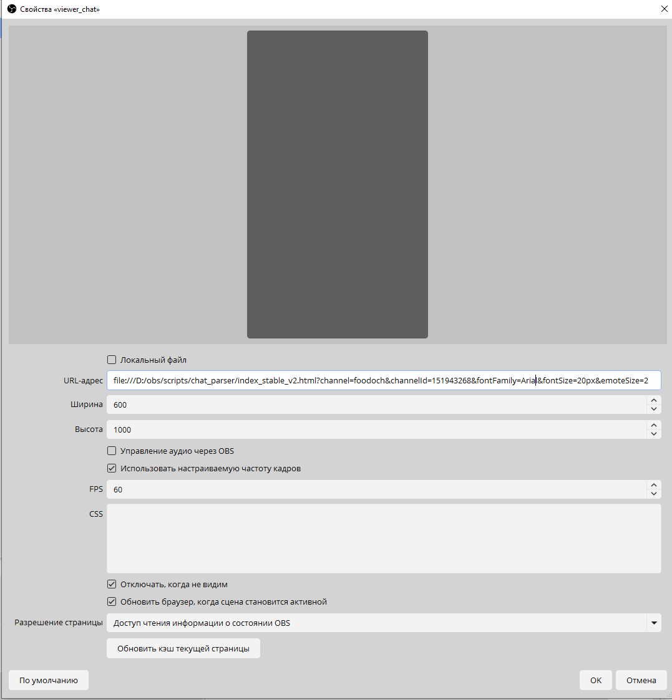

# Простой чат для OBS 

Выводит чат твич в обс для показа на трансляции. 

```
file:///D:/obs/scripts/twitch_chat_viewer/index.html?channel=foodoch&channelId=151943268&typewriterEffect=true&typewriterSpeed=10&fontFamily=Segoe%20UI&fontSize=20px&debug=true
```

Имеет несколько настроек:
| Параметр | Пример | Объяснение |
|----------|----------|----------|
| channel   | foodoch | Название канала   |
| channelId    | 151943268 | ID канала, можно получить в [сервисе](https://www.streamweasels.com/tools/convert-twitch-username-%20to-user-id/)  |
| typewriterEffect  | true | Включает эффект печатной машинки |
| typewriterSpeed  | 10 | Задает задержку появления символов |
| fontFamily  | Segoe UI | Задает шрифт текста |
| fontSize  | 20px | Задает размер текста |
| debug  | true | Включает режим отладки, испрользуется только в полноценных браузерах через F12 |